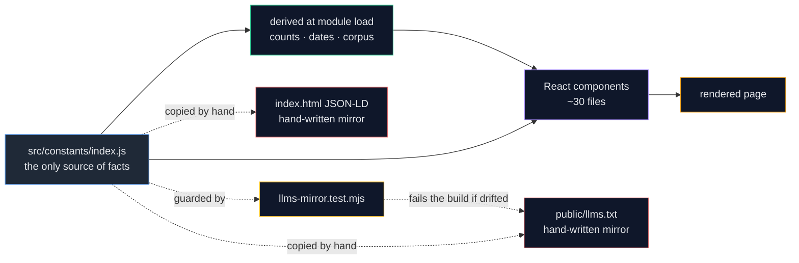
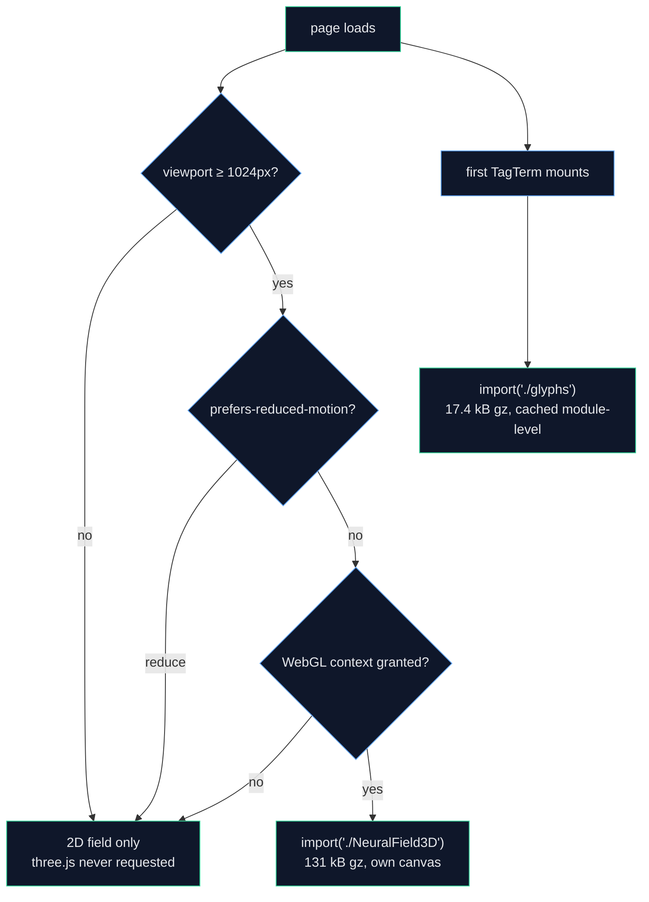
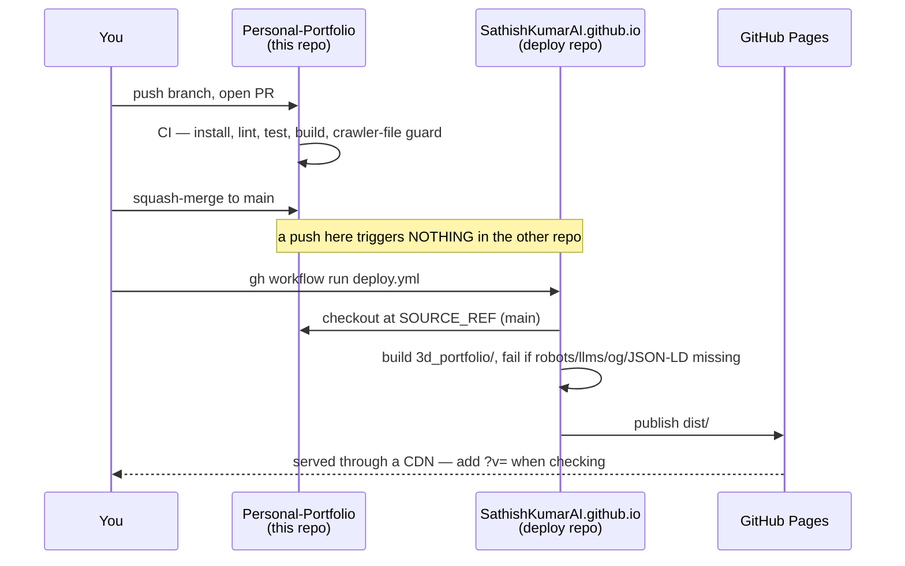

# Architecture

How the site actually works, for someone who has to change it without breaking it.
`README.md` answers *"where do I edit this?"*. This page answers *"what happens
when someone loads the page, and why is it built this way?"*

## Core shape

One React page, statically built, no backend, no API key, no database, no
analytics. Everything a reader sees is either in `src/constants/index.js` or
derived from it at module load. That constraint is the reason several things that
look expensive are cheap: the ask box needs no server because the corpus is the
page's own copy, and the site survives a network with nothing behind it.



**A fact hard-coded in a component is a bug.** `4 roles · since 2020` is
`ROLES.length` and the earliest `start`; `06 projects` is `projects.length`;
`33 tools` is a `Set` over every `items` array. Add a project and four places
update in the same edit — the spec band, the Projects eyebrow, the ask-box corpus
and the availability card.

The two hand-written mirrors are the exception, and they exist because prose for a
crawler reads better than a dump. They are the only files that can silently
disagree with the source, which is why `llms-mirror.test.mjs` exists (see
[Tests](#tests-what-each-one-actually-protects)).

## What a reader downloads, and when

The entry bundle is deliberately small, and the two expensive things are behind a
dynamic `import()`.

| Chunk | Raw | Gzipped | Who fetches it |
| --- | --- | --- | --- |
| `index-*.js` (app) | 108 kB | **36.0 kB** | everyone |
| `react-*.js` | 141 kB | 45.1 kB | everyone |
| `motion-*.js` (framer) | 120 kB | 39.7 kB | everyone |
| `vendor-*.js` | 4 kB | 1.8 kB | everyone |
| `index-*.css` | 42 kB | 9.1 kB | everyone |
| `glyphs-*.js` (41 tool marks) | 39 kB | **17.4 kB** | on the first chip mount |
| `NeuralField3D-*.js` (three.js) | 523 kB | **131.1 kB** | desktop + motion allowed + WebGL only |



Two rules keep this true, and both have already been violated once:

- **three.js must stay unnamed in `manualChunks`.** `vite.config.ts` returns
  `undefined` for it on purpose. Naming it puts it in `vendor`, which is in the
  entry graph, and a phone downloads 131 kB gzipped for a scene it will never run.
- **Import it by name, never as a namespace.** `await import("three")` yields a
  namespace object that must carry every export, so nothing tree-shakes:
  **191.8 kB gzipped against 131.1 kB** for the ten named classes the scene uses.

## The theme cascade

Six palettes on two axes, resolved before first paint.

```
localStorage.theme ─┐
                    ├─► boot script in index.html (runs in <head>, pre-paint)
   default "light" ─┘        │
                             ├─► <html data-theme="light|dark|ink|sepia|clean|paper">
                             └─► <html data-scheme="light|dark">
```

- **`data-theme` picks the palette.** Every colour is a CSS custom property
  (`--c-primary`, `--c-accent`, `--c-cat-*`) redefined per theme.
- **`data-scheme` picks the *structure*.** Glass shadows, the hero bloom, the film
  grain and the category ramp key off light-vs-dark, not off the palette name.
  That second axis exists because `:not([data-theme="dark"])` stops being a usable
  selector at the third palette.
- **The boot script is inline and duplicated from `constants`.** It has to run
  before the first paint or every reader watches the page change colour, and
  nothing can be imported that early. The duplication is deliberate and commented
  at both ends.
- **Paper is the default for a first-time reader**, overruling
  `prefers-color-scheme`. See [DECISIONS](DECISIONS.md#paper-is-the-default-palette).

`ThemeToggle` is the only writer of those attributes. The command palette asks for
a theme by id through a `set-theme` event rather than writing them itself — when
it wrote them directly the toggle's `useState` went stale and the button needed
two clicks.

## Layout: scenes, stage and measure

`SectionWrapper` is an HOC every section passes through. It splits two jobs that
used to be one element:

```
<section class="scene">        ← the STAGE: full-bleed, paints the ground
  <span id="roles"/>           ← the anchor
  <div class="max-w-7xl">      ← the MEASURE: where the text lives
```

Before, `max-w-7xl mx-auto` sat on the `<section>`, so a section could never paint
a background wider than its own text column. Alternating grounds
(`main > section:nth-of-type(odd)`) then fall out of the sequence, not out of a
prop — a component told its own index is wrong the moment the order changes, and
this page has reordered twice.

## Motion budget

Five things move. Every one of them is metered.

| Effect | Where | Guard |
| --- | --- | --- |
| Hero field (WebGL) | `NeuralField3D.js` | ≥1024px, motion allowed, WebGL available; stops when the hero scrolls away or the tab hides |
| Hero field (2D fallback) | `NeuralField.jsx` | same breakpoint; one settled frame under reduced motion |
| Career diagrams | `CareerTrack.jsx` | desktop only, one rAF loop for four diagrams, active role polled on a timer not per frame |
| Role-edge light | `.role-card[data-current]::before` | ≥640px, 9s a turn, `@property` with a static fallback |
| Card reveals, deck dimming | `Reveal.jsx`, `useCoveredCards` | `MotionConfig reducedMotion="user"`; the deck handler batches reads before writes |

**The CSS `prefers-reduced-motion` block does not cover framer.** It zeroes CSS
`animation-duration` and `transition-duration` only, and framer writes `opacity`
and `y` as inline styles from its own rAF loop. `initial={reduced ? false : …}` is
what actually stops it.

## The ask box

`Ctrl K` retrieves from the page's own text. No model, no key, no request.

1. **Corpus** — 19 documents built at module load from `constants`: one per role,
   degree, stack group and project, plus the availability card.
2. **Score** — term overlap weighted by inverse document frequency, title hits
   doubled, then divided by a BM25-style length norm `0.4 + 0.6 · len/avg`.
3. **Stem** — `-ing`, `-ed`, `-s`, then one doubled consonant, applied identically
   to the query and the corpus: `shipped` and `ship` land on the same key.
4. **Alias** — six words a recruiter types and this site never uses (`hire`,
   `job`, `available` …).
5. **Cut** — anything under a third of the top score is dropped; an empty result
   returns the email rather than a guess.
6. **Quote** — the answer is the best-matching *sentence*, verbatim. Nothing is
   generated, and a test asserts it.

Two ranking bugs were found by asking it real questions: long documents won on
volume until length normalisation landed, and `Shipped` did not match `ship` until
the stemmer did. Both are pinned by tests named for the failure.

## Tests: what each one actually protects

`npm test` is 27 checks in four plain-node files. No framework, no fixtures — the
repo has no runner and does not need one.

| File | Checks | The failure it exists for |
| --- | --- | --- |
| `utils/answer.test.mjs` | 8 | A citation that is generated rather than quoted; a cited section that is not a real nav id; `ship` not matching `Shipped` |
| `utils/localzone.test.mjs` | 5 | An offset that is right in July and wrong in January — India to US Central is +11:30h then +10:30h |
| `utils/llms-mirror.test.mjs` | 7 | The crawler copy drifting from `constants`. It shipped with **no employment history at all**; this is the check that would have caught it |
| `utils/html-mirror.test.mjs` | 7 | The other two hand-written mirrors: the JSON-LD a search engine reads, and the `<noscript>` block that is the only content in the served HTML. Also that `og-card.html` still names the current role |

Each was proved to fail before being trusted: the mirror guard was run against a
copy with the Roles section deleted and reported the three employers and four role
titles by name.

## Build and deploy topology

Two repositories, one source of truth. This surprises everyone once.



- **The site lives in `3d_portfolio/`, not the repo root.** Vercel needs
  `--cwd 3d_portfolio`; the deploy workflow sets `SOURCE_DIR`.
- **A repo named `<user>.github.io` is served from the domain root**, which is the
  only reason that second repo exists. It keeps Vite's `base` at `/` so one build
  serves both Pages and any future Vercel deploy.
- **Verify a deploy by bundle hash, not by eye.** `ls dist/assets` against what the
  live HTML references; the CDN will happily serve you yesterday's page.

## Failure modes worth knowing before you edit

| Symptom | Cause |
| --- | --- |
| The Roles deck silently becomes a flat list | `overflow-x: hidden` or `overflow: auto` on a wrapper above it. An overflow container is also a scroll container. `html`/`body` are exempt — their overflow propagates to the viewport |
| Blank hero field, `Cannot read properties of null (reading 'precision')` | Something took a 2D context on the canvas first, or `forceContextLoss()` poisoned it. A canvas keeps its first context for life |
| A brand logo renders blank or as a dot | Someone "optimised" the SVG path with a regex. In `a5.5 5.5 0 01.5.5` the `01.5` is two arc flags and a number |
| Two role cards showing each other's text | `opacity` on `.role-card` instead of its children — the ground goes translucent with the content |
| The deck scroll stutters | The covered-card handler reading a rect after writing an attribute. Batch all reads first |
| Category colours climb then jump back | `stackGroups` reordered without reordering `--c-cat-*`. They are a ramp now, not a set |
| A comment describing copy that no longer exists | A component justified itself by quoting the headline. Quote the mechanism, not the words |

## See also

- [DECISIONS.md](DECISIONS.md) — why each of these is the way it is
- [LEARNING-NOTES.md](LEARNING-NOTES.md) — the same techniques explained from scratch
- [../README.md](../README.md) — the change→file table
- [WORKLOG.md](WORKLOG.md) — the measurements behind every claim here
